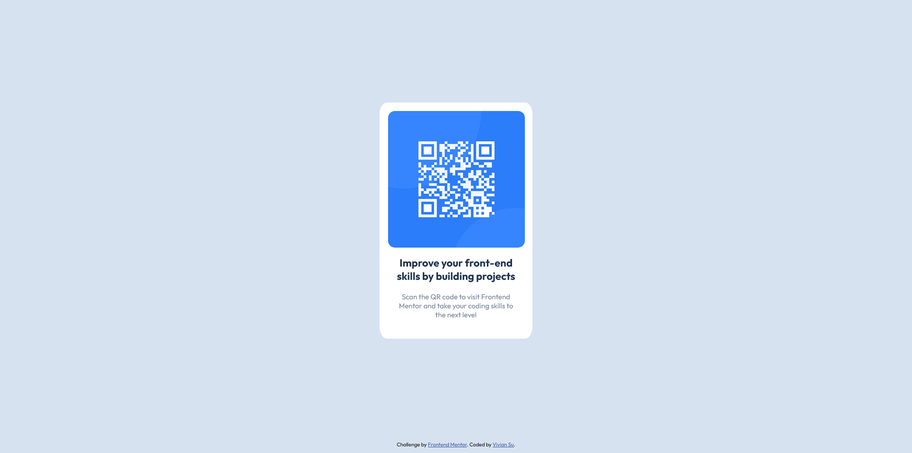

# Frontend Mentor - QR code component solution

This is a solution to the [QR code component challenge on Frontend Mentor](https://www.frontendmentor.io/challenges/qr-code-component-iux_sIO_H). Frontend Mentor challenges help you improve your coding skills by building realistic projects. 

## Table of contents

- [Frontend Mentor - QR code component solution](#frontend-mentor---qr-code-component-solution)
  - [Table of contents](#table-of-contents)
  - [Overview](#overview)
    - [Screenshot](#screenshot)
    - [Links](#links)
  - [My process](#my-process)
    - [Built with](#built-with)
    - [What I learned](#what-i-learned)
    - [Useful resources](#useful-resources)
  - [Author](#author)

## Overview

### Screenshot



### Links

- Solution URL: [https://github.com/YingJhen-Su/frontend-mentor-qr-code-component](https://github.com/YingJhen-Su/frontend-mentor-qr-code-component)
- Live Site URL: [https://yingjhen-su.github.io/frontend-mentor-qr-code-component/](https://yingjhen-su.github.io/frontend-mentor-qr-code-component/)

## My process

### Built with

- HTML5
- CSS Flexbox
- Google Fonts
  
### What I learned
I learned how to center webpage content using CSS Flexbox.

```css
.wrap {
    min-width: 100%;
    min-height: 100%;
    display: flex;
    flex-direction: column;
    justify-content: center;
    align-items: center;
    margin-bottom: -25px;
}
```

### Useful resources

- [footer置底的五種方式](https://medium.com/yuchiwangsha/footer%E7%BD%AE%E5%BA%95%E7%9A%84%E4%BA%94%E7%A8%AE%E6%96%B9%E5%BC%8F-4eeb9ba3ff2d) - This helped me understand how to keep the footer at the bottom when the webpage content is too short.

## Author

- Frontend Mentor - [@YingJhen-Su](https://www.frontendmentor.io/profile/YingJhen-Su)
